```{r setup, include=FALSE}
library(tidyverse)
require(data.world)
require(dplyr)
knitr::opts_chunk$set(echo = TRUE)
#rm(list=ls())
```

## **R Session Info**  

```{r}
sessionInfo()
```

```{r}
#Connecting to data.world
project <- "https://data.world/nikhilbhargava/f-17-edv-project-5"
data.world::set_config(cfg_env("DW_API"))
```

## Link to Data.World project
###[Project 5 Group 10 Data.world Link](https://data.world/nikhilbhargava/f-17-edv-project-5 "F17 eDV Final Project Data.world")

_________________________

## **Cleaning Our Initial Data Set**

###Starting with "Dirty" Data

We began in Project 5 by downloading a data set from instacart and nutritional fact data. Initially, the data was riddled with special characters, blank spaces, and unfriendly formatting. 

Below is the code for the data input from the CSV file.
```{r}
dfDirty <- (read_csv("f-17-edv-project-5-final.csv", col_types = cols(
  `calcium` = col_number(),
  `calories` = col_number(),
  `Caloriesfrom_Fat` = col_number(),
  `chole-sterol_1` = col_number(),
  `chole-sterol` = col_number(),
  `dietary_fiber_1` = col_number(),
  `dietary_fiber` = col_number(),
  `food_type` = col_character(),
  `food_and_serving` = col_character(),
  `number_of_records` = col_number(),
  `potassium_1` = col_number(),
  `potassium` = col_number(),
  `protein` = col_number(),
  `saturated_fat_1` = col_character(),
  `saturated_fat` = col_character(),
  `serving_size` = col_character(),
  `sodium_1` = col_number(),
  `sodium` = col_number(),
  `sugars` = col_number(),
  `total_carbo_hydrate_1` = col_number(),
  `total_carbo_hydrate` = col_number(),
  `total_fat_1` = col_number(),
  `total_fat` = col_number(),
  `vitamin_a` = col_number(),
  `vitamin_c` = col_number(),
  `add_to_cart_order` = col_number(),
  `aisle` = col_character(),
  `aisle_id_aisles_csv` = col_number(),
  `aisle_id` = col_number(),
  `days_since_prior_order` = col_number(),
  `department` = col_character(),
  `department_id_departments_csv` = col_number(),
  `department_id` = col_number(),
  `eval_set` = col_character(),
  `order_dow` = col_number(),
  `order_hour_of_day` = col_number(),
  `order_id_orders_reduced_csv` = col_number(),
  `order_id` = col_number(),
  `order_number` = col_number(),
  `product_id_order_products_train_reduced_csv` = col_number(),
  `product_id` = col_number(),
  `product_name` = col_character(),
  `reordered` = col_logical(),
  `user_id` = col_number(),
  `iron` = col_number()
)))
```


###Cleaning the dataset: R code, replacing special characters

```{r}
# Cleaning up special characters
for(n in names(dfDirty)) {
  dfDirty[n] <- data.frame(lapply(dfDirty[n], gsub, pattern="[^ -~]", replacement= ""))
}
```

### Exporting the cleaned CSV
```{r}
dfClean <- dfDirty
write_csv(dfClean, "cleanFinalData.csv")
```

## Data Model

Our data set consists of five different CSV files, aisles, departments, order_products_train, orders and products. Since they are all related, it was necessary to create a data model to see how they could be joined together so that they could be used together. The following data model was created.

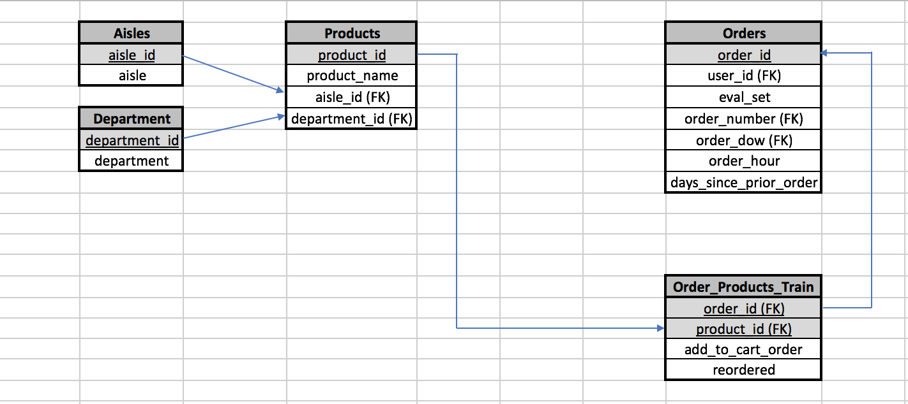

Aisles and departments could be joined with products and products could be joined with order_products train which could then be joined with orders. Now that we know how we could join our data, we did the same thing, but in tableau. Unfortunately, Tableau Public could not run how many rows we had in both order_products_train and orders (about 3 million rows). This meant that we needed to decrease the amount of rows we were looking at.

For the sake of this project, and to have a manageable amount of data, we wanted to have about 10,000 rows of data. Our data set is unique because order_products_train has multiple of the same order_ids as users reorder items at any given time. This means that every order_id (essentially user, could order an item anytime throughout the time period used in the data set). Additionally, every order_id has the order in which a user made that transaction. Since this data is important and the data is not organized by a specific date something was purchased, we decided it was not necessary to take a random sample, but instead more important to get all the information of each order_id. Therefore, we cut off the data at a certain number of rows. Deducing the number of rows was based off of trial and error. In an attempt to not cut off any order_ids, the following SQL query was run multiple times to get the number of rows of data to about 10,000.

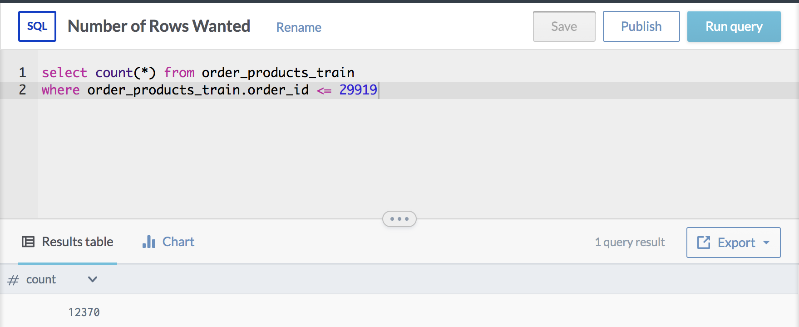


After determining the cut off for the number of orders we want to accept to be 29919, we created smaller data sets of both order_products_train and orders. The following SQL query was used to do that and then these tables were re-uploaded to our data.world data set & project. This can be seen below.

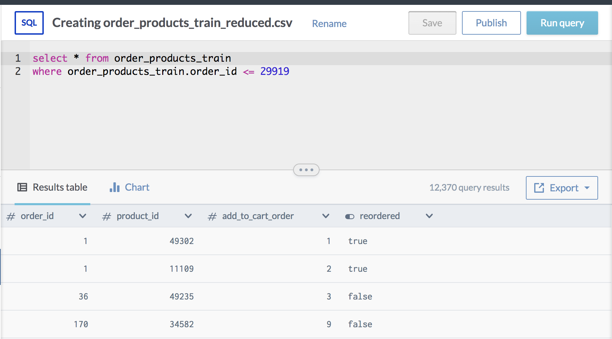
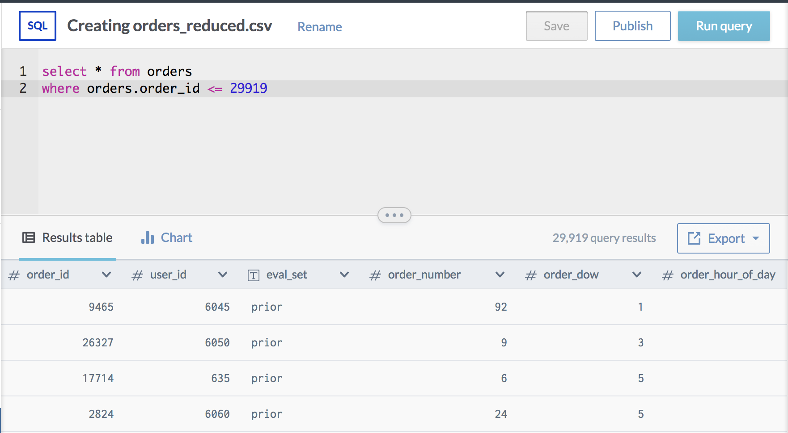
Using Tableau Public, we were finally able to join our data based off of the data model from above. In the figure below, we can see that products had an inner join with order_products_train, aisles and department as we wanted to obtain a union of this data. Orders csv was left joined with order_products_train, as we only wanted to get addition order information from the orders on order_products train. The two tables were joined on the column order_id. This can be visualized below:

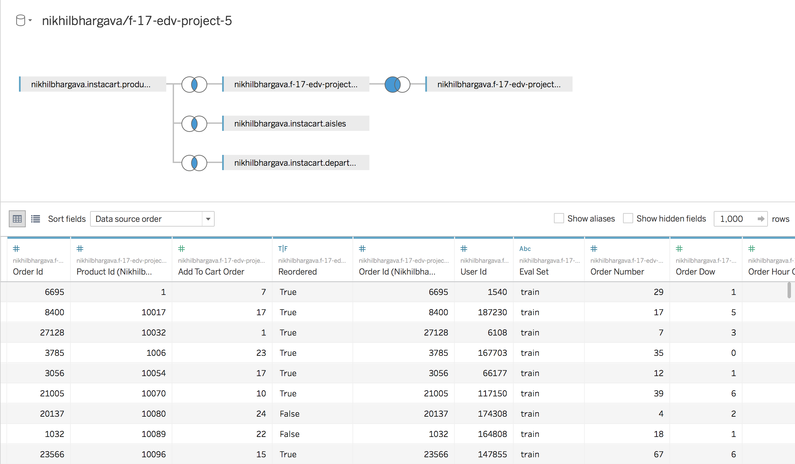
##New Data Model & Join

When taking a look at our data in Tableau, there was a lack of interesting measures that could be visualized using this data set. Therefore I joined another csv file (NutritionalFacts_Fruit_Vegetables_Seafood) to what we had currently. This data set contains nutritional information on all sorts of generic fruits, vegetables and seafood. The intent of joining this data is to get more measures that we could visualize and to find more correlations. Below is the initial correlations of the measures we had (very difficult to decipher):

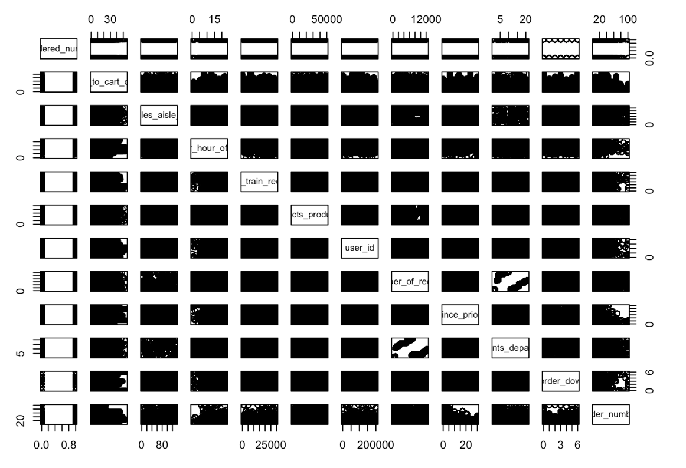

To do so I did a left join of the NutritionalFacts_Fruit_Vegetables_Seafood CSV to the Products CSV so that we could see certain Instacart products nutritional facts. The only down side of doing this is that often times Instacart names items differently than how we call them usually (for example "Large Lemon" vs. Lemon or "Smoked Salmon" vs. "Salmon"). Therefore the amount of items we have nutritional facts on is a much smaller sub set of our Instacart data. The join used can be visualized in Tableau below (and is attached to our data.world project).

The new data model for our project now looks like this:

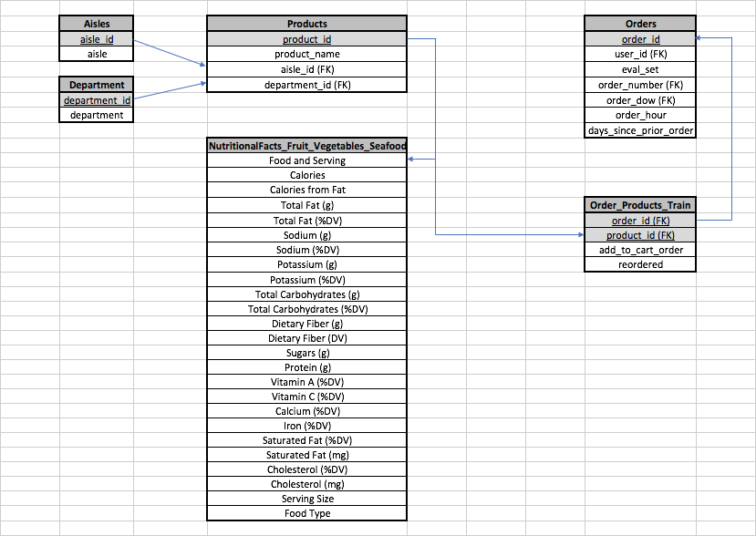

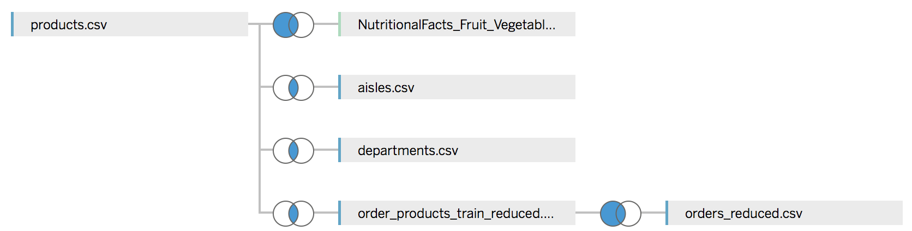
_________________________

## **Daniel Yang's Insights**

###Most popular Products
#### [Insight Link: Most popular prodcuts](https://data.world/nikhilbhargava/f-17-edv-project-5/insights/d32e288e-b194-458f-9bfa-2c2fb80a049a)
<iframe align = "center" width = "1000" height = "1000" src="https://public.tableau.com/profile/daniel.yang#!/vizhome/InstaCartDVFinalProject/Mostpopularproductsalltime?publish=yes"/>

###Distinct users throughout the day
#### [Insight Link: Distinct users throughout a day and from department was ordered](https://data.world/nikhilbhargava/f-17-edv-project-5/insights/b6fb6098-271b-4701-855c-408a2cd355c7)
<iframe align = "center" width = "1000" height = "1000" src="https://public.tableau.com/profile/daniel.yang#!/vizhome/InstaCartDVFinalProject/Distinctusersthroughtheday?publish=yes"/>

###Number of Products for each Department and Aisle
#### [Insight Link: Number of Products for each Department and Aisle](https://data.world/nikhilbhargava/f-17-edv-project-5/insights/7ba96095-d29f-41a1-ad07-e7b5687cc01f)
<iframe align = "center" width = "1000" height = "1000" src="https://public.tableau.com/profile/daniel.yang#!/vizhome/InstaCartDVFinalProject/ofproductsforeachdeptandaisle?publish=yes"/>

###Sugar vs Total Carbs
#### [Insight Link: Sugar vs. Total Carbohydrates](https://data.world/nikhilbhargava/f-17-edv-project-5/insights/d7d0ba68-8c58-4744-87f8-3f1fe538bf35)
<iframe align = "center" width = "1000" height = "1000" src="https://public.tableau.com/profile/daniel.yang#!/vizhome/InstaCartDVFinalProject/CorrelationTotalCarbsandSugars?publish=yes"/>

###Department-Aisle Cross Tab
#### [Insight Link: Dept-Aisle CrossTab](https://public.tableau.com/profile/daniel.yang#!/vizhome/InstaCartDVFinalProject/Dept-AisleCrossTab?publish=yes)
<iframe align = "center" width = "1000" height = "1000" src="https://public.tableau.com/profile/daniel.yang#!/vizhome/InstaCartDVFinalProject/Dept-AisleCrossTab?publish=yes"/>

## **Anna Kong's Insights**

### **Cleaning our Nutitional Data** 

#### [Insight Link: Cleaning Nutritional Data](https://data.world/nikhilbhargava/f-17-edv-project-5/insights/f4c8ed41-a443-4d43-889a-d41a3d6114b4)


The Nutritional Data we found had some issues with its column names and text format, so we had to do some cleaning before working with it.

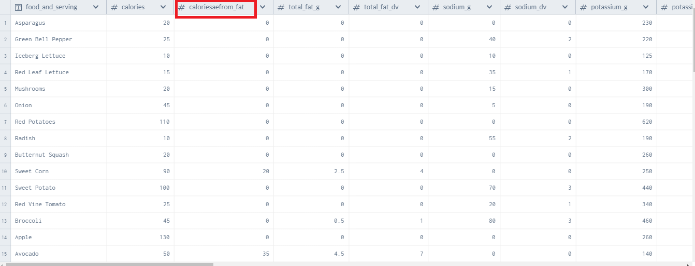

Below is the code for the data input from the CSV file. (Click on "Code" to show details)

```{r}
dfDirty <- (read_csv("uncleanNutritionData.csv", col_types = list(
  `food_and_serving` = col_character(),
  `calories`= col_number(),
  `caloriesaefrom_fat` = col_number(),
  `total_fat_g` = col_number(),
  `total_fat_dv` = col_number(),
  `sodium_g` = col_number(),
  `sodium_dv` = col_number(),
  `potassium_g` = col_number(),
  `potassium_dv` = col_number(),
  `total_carbo_hydrate_g` = col_number(),
  `total_carbo_hydrate_dv` = col_number(),
  `dietary_fiber_g` = col_number(),
  `dietary_fiber_dv` = col_number(),
  `sugars_g` = col_number(),
  `protein_g` = col_number(),
  `vitamin_a_dv` = col_number(),
  `vitamin_c_dv` = col_number(),
  `calcium_dv` = col_number(),
  `aeaeironaeae_dv` = col_number(),
  `saturated_fat_dv` = col_number(),
  `saturated_fat_mg_ae` = col_number(),
  `chole_sterol_dv` = col_number(),
  `chole_sterol_mg_ae` = col_number(),
  `serving_size` = col_character(),
  `food_type` = col_character()
)))
```

We clean up the dataset's column names.

```{r}
# Cleaning up special characters
for(n in names(dfDirty)) {
  dfDirty[n] <- data.frame(lapply(dfDirty[n], gsub, pattern="[^ -~]", replacement= ""))
  dfDirty[n] <- data.frame(lapply(dfDirty[n], gsub, pattern="ServingSize", replacement= "Serving Size"))
  dfDirty[n] <- data.frame(lapply(dfDirty[n], gsub, pattern="eweight", replacement= "e weight"))
  dfDirty[n] <- data.frame(lapply(dfDirty[n], gsub, pattern="mweight", replacement= "m weight"))
}


# Cleaning up column names
colnames(dfDirty) <- gsub(pattern = "sae", replacement = "s_", colnames(dfDirty))
colnames(dfDirty) <- gsub(pattern = "_?ae", replacement = "", colnames(dfDirty))  
colnames(dfDirty) <- gsub(pattern = "carbo_hydrate", replacement = "carbohydrate", colnames(dfDirty))
colnames(dfDirty) <- gsub(pattern = "chole_sterol", replacement = "cholesterol", colnames(dfDirty))
```

Finally, we export the new dataset as a csv, to be uploaded to Data.world

```{r}
dfClean <- dfDirty
write_csv(dfClean, "cleanNutritionData.csv")
```

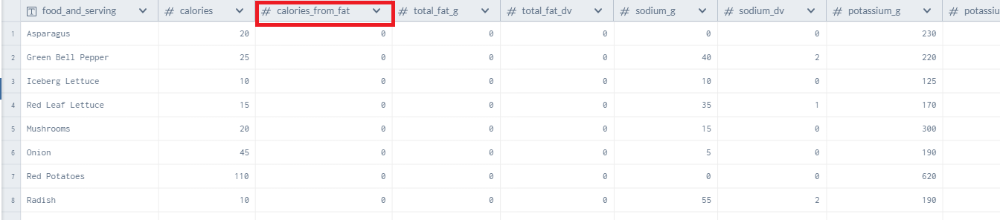

 
______________________________________
 
## **Nikhil Bhargava's Insights**

##Top Reordered Items

While playing around with the data set, I wanted to know which items would be the most reordered. Using Tableau, I was able to visualize this by creating a bar chart of reordered items by produce id. First, in order to do this, a calculated field must be created. This was based off of the column reordered which was a boolean True/False. Every time an item was reordered (True), I wanted to create a numerical column of 1s and 0s to count the number of reordered items. The table calculation is shown below:

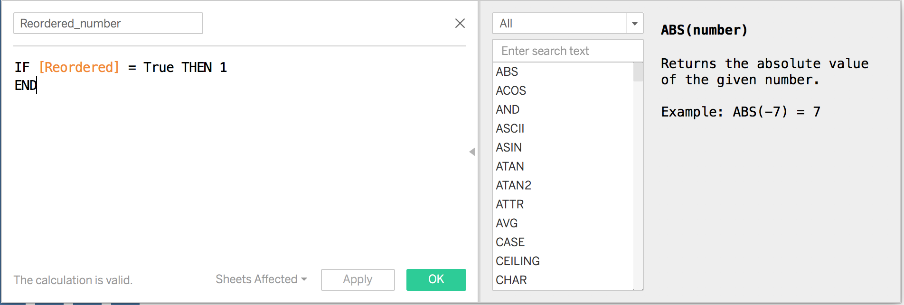
The visualization using this field is shown below (top reordered items):

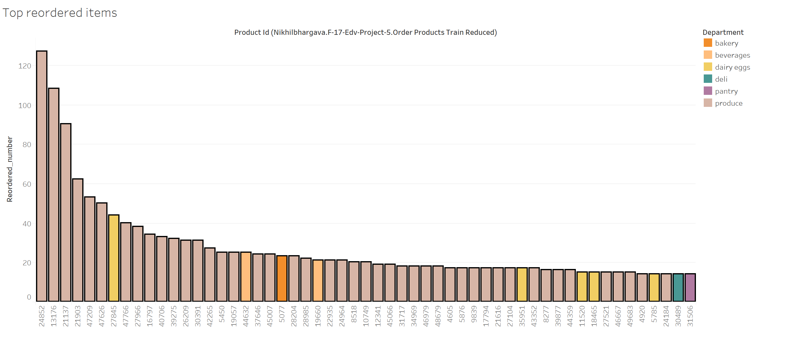

Surprisingly, bananas and organic bags of bananas are the items that are reordered the most. I colored each product by their respective departments. In doing so, it was easy to see that the most reordered items were in the produce department, which makes sense. To see if there was anything else interesting based on what was being reordered, I created another bar chart to see the most number of reordered items by department . This can be seen below:

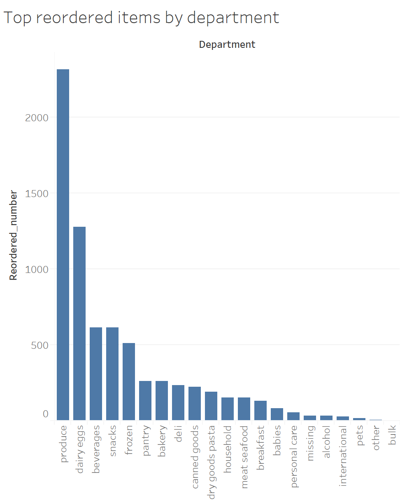

Both the produce and dairy eggs department are the dominant reordered departments.

At this point, it would also be necessary to understand our reordered item data on a per aisle basis. This can be seen below:

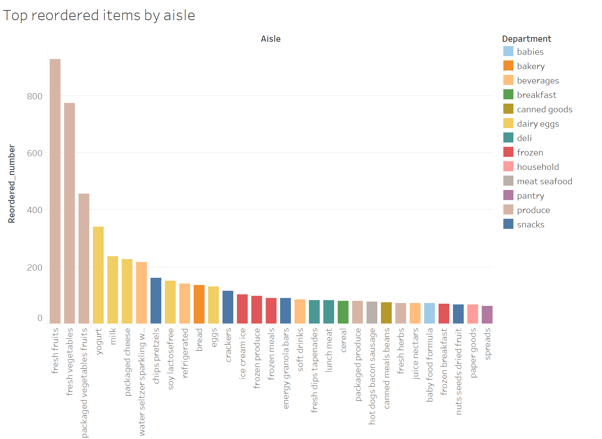

Unsurprisingly, aisles that are in the produce and dairy eggs department are the most reordered aisles. However, it is interesting to see such a mixture of aisles by department after the first six aisles. This may suggest that there is a pretty even distribution of reordered items outside of the aisles that are contained in the two dominant departments.

##Number of products ordered by Hour

In this insight we will be taking a look at a visualization of the number of orders Instacart receives during each hour of the day. The following chart was done in Tableau.

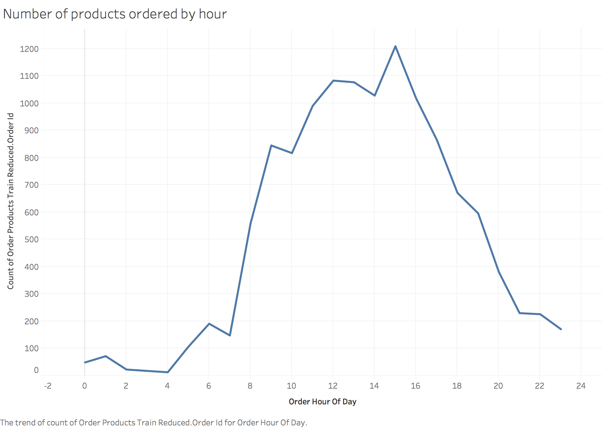
As can be seen by this chart, the peak hours of orders are around 7am - 7pm. This would make sense as these are generally the most common business hours. Something I found interesting is the lack of orders made late during the night as I expected that to be the time most people would be lazy and want someone to deliver something from the grocery to them that they either don't have, don't want to go back to the store to get or want a late night snack. During the day, 4am is the time Instacart is used (makes sense because this is very late at night when most people are sleeping), but I did find it interesting that the peak hour in which orders are made is 3pm as that is still during work/business hours. An explanation for this may be that it takes a while for Instacart to deliver groceries and it will arrive by the time people come home from work or this is when people using the app generally plan for dinner (stay at home parents).

As I found this previous chart to be extremely interesting, I thought it would be awesome to see the number of distinct orders during these hours as well. The same visualization was made below, except for the number of distinct orders at each hour.

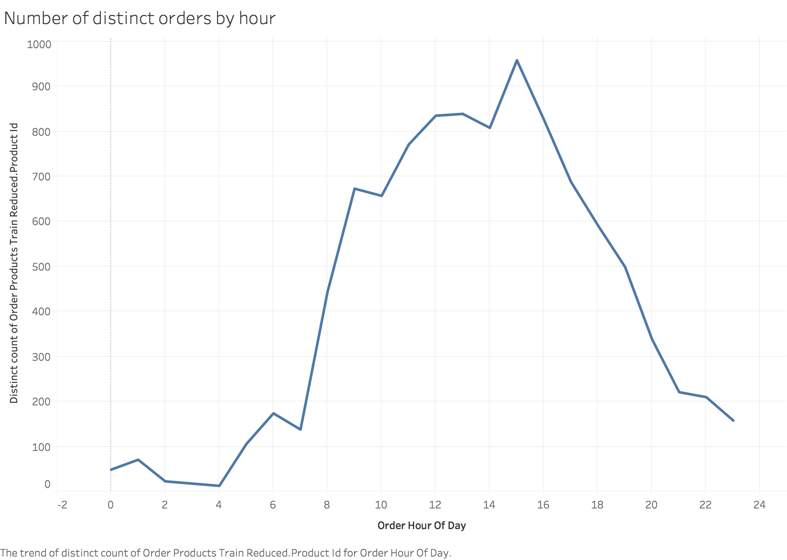
Although this chart looks almost identical to the one above it (which is extremely interesting as I thought the shape would at least change a little bit), it looks as though it was just shifted down a little bit. This must mean that at each hour, there is are very few reorders orders.

##Average Days Since Prior Order by Department

I thought it would be very interesting to see which departments are being reordered the most frequently.

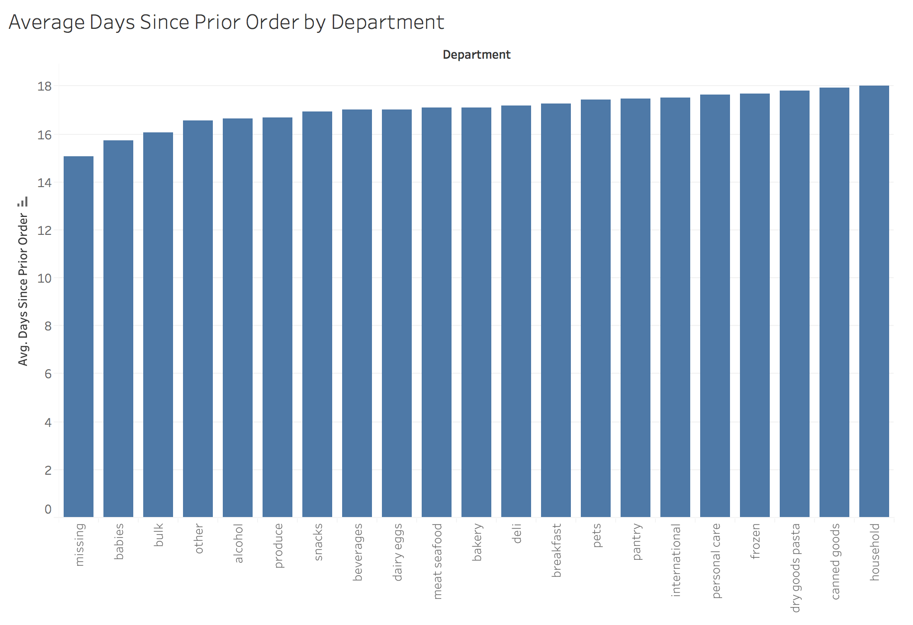

Missing doesn't really give any interesting information although it is the most frequently reordered department. Babies department being the 2nd most frequently was surprising to me as I thought, considering produce, usually had the most ordered items, would have a heavy influence on items that are being ordered often. Bulk goods being reordered the third most was also a surprise to me as I would believe those goods would last long and wouldn't need to be ordered that often. Produce being ordered the 5th most was a surprise as well since, as I said earlier, thought it would be the first most frequently reordered item.

##Max Protein

After creating a scatterplot of sodium vs. protein, I wanted to see which products had the most protein and what department and aisle they were in. I did this process using DPLYR in R. The code for this is shown below:

```{r}
require(dplyr)
require(data.world)
project <- "https://data.world/nikhilbhargava/f-17-edv-project-5"
data.world::set_config(cfg_env("DW_API"))
df <- data.world::query(data.world::qry_sql("SELECT * FROM f_17_edv_project_5_finaljoined"), dataset = project)

require(ggplot2)
require(shiny)
```

```{r}
require(dplyr)
products <- filter(df, complete.cases(protein_g))
unique_prods <- dplyr::distinct(products, product_name, aisle, department, protein_g)
products_satfat <- arrange(unique_prods, desc(protein_g))
final_protein <- dplyr::select(products_satfat, product_name, aisle, department, protein_g)
final_protein
```

Using filter, I was able to remove all of the N/As our data has due to a left join of such a large database of products. I then use arrange to sort the products by highest to lowest amounts of protein and then use select to view the related data. This resulted in this table:

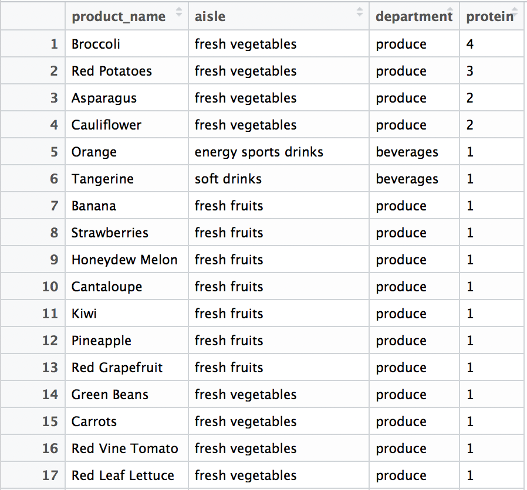

Broccoli is the item that contains the most protein, then the red potatoes and then asparagus.

Below is the respective SQL code:

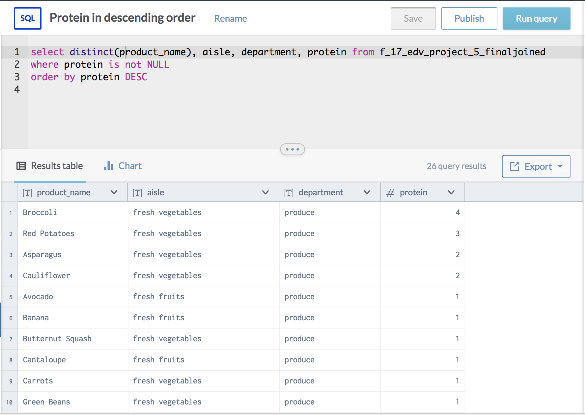

##Sugar Box Plot
#### [Insight Link: Sugar Box Plot](https://public.tableau.com/profile/nikhil.bhargava#!/vizhome/Instacart-BoxplotFinal/Sheet4?publish=yes)
<iframe align = "center" width = "1000" height = "1000" src="https://public.tableau.com/profile/nikhil.bhargava#!/vizhome/Instacart-BoxplotFinal/Sheet4?publish=yes"/>

##Input Panel - Sodium vs. Protein

```{r}
inputPanel(
  sliderInput("sodMin", label = "Select Minimum Sodium Value",
              min = 0, max = 100, value = 0, step = 5),
  sliderInput("sodMax", label = "Select Maximum Sodium Value",
              min = 0, max = 100, value = 100, step = 5)
)

inputPanel(
  sliderInput("sProMin", label = "Select Minimum Protein Value",
              min = 0, max = 5, value = 0, step = 1),
  sliderInput("sProMax", label = "Select Maximum Protein Value",
              min = 0, max = 5, value = 5, step = 1)
)

renderPlot({ggplot(data = df) +
  geom_point(mapping = aes(x = as.numeric(protein_g), y=as.numeric(sodium_g))) +
  theme(axis.text.x = element_text(angle = 0, hjust = 7)) +           
  ylim(input$sodMin, input$sodMax) + 
  xlim(input$sProMin, input$sProMax)
})
```

______________________________________

## **Interesting Findings/Summary**

______________________________________

## **Appendix: Concepts Covered**
* input panel/event reactive
* ggplot
* tableau line graph
* boxplot
* bar chart
* histogram
* scatter plot
* data joining
* data model
* SQL querying
* dplyr pipelines
* cross table
* level of detail calculated field
* data cleaning
* ETL

Anna's stuff
* gather (Reformat)
* dplyr mutation