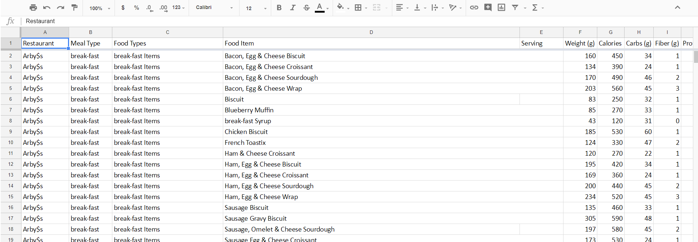

```{r setup, include=FALSE}
library(tidyverse)
require(data.world)
require(dplyr)
knitr::opts_chunk$set(echo = TRUE)
```

## **R Session Info**  

```{r}
sessionInfo()
```

## **Link to Data.world project**  
###[Project 4 Group 10 Data.world Link](https://data.world/nikhilbhargava/f-17-edv-project-4 "F17 eDV Project 4 Data.world")

_________________________


## **Step 1: Input(CSV)** 

###Starting with "Dirty" Data

We began in Project 1 by downloading a data set on fast food nutritional data. Initially, the data was riddled with special characters, blank spaces, and unfriendly formatting. The screenshot below shows an example of what some of the data looked like. Note the "$" characters in the restaurant name. There were also inconsistent duplicate titles. For our previous projects, we manually cleaned our data by hand. For this project, we will be cleaning it with code in R.



Below is the code for the data input from the CSV file.

```{r}
dfDirty <- (read_csv("dirtyFFdata.csv", col_types = list(
  Restaurant = col_character(),
  `Meal Type`= col_character(),
  `Food Types` = col_character(),
  `Food Item` = col_character(),
  Serving = col_number(),
  `Weight (g)` = col_number(),
  Calories = col_number(),
  `Carbs (g)` = col_number(),
  `Fiber (g)` = col_number(),
  `Protein (g)` = col_number(),
  `Fat (g)` = col_number(),
  `% Cals from Fat` = col_number(),
  `Saturated Fat (g)` = col_number(),
  `Trans Fat (g)` = col_number(),
  `Cholesterol (mg)` = col_number(),
  `Sodium (mg)` = col_number()
)))
```

_________________________


## **Step 2: Clean**
###Cleaning the dataset: R code, replacing special characters

```{r}
for(n in names(dfDirty)){
  dfDirty[n] <- data.frame(lapply(dfDirty[n], gsub, pattern="[^ -~]",replacement = ""))
}

```

_________________________


## **Step 3: Export**
### Exporting the cleaned CSV to to computer
```{r}
dfClean <- dfDirty
write_csv(dfClean, "newFFdata.csv")

#col_names = c("Restaurant","Meal Type","Food Type","Food Item",
#"Serving","Weight","Calories","Carbs","Fiber","Protein","Fat","% sals from Fat","Saturated Fat", "Trans Fat", "Cholesterol",
#"Sodium",
```

#### Uploading the cleaned dataset to Data.world


_________________________


## **Step 4: Input(R)**
### Using an SQL Query to select Data from Data.world

We select all items that are not of the "Condiments" meal_type

```{r}
project <- "https://data.world/nikhilbhargava/f-17-edv-project-4"
data.world::set_config(cfg_env("DW_API"))
df <- data.world::query(data.world::qry_sql("SELECT * FROM Fastfood_Data_Clean_Project4 WHERE meal_type != 'Condiments'"), dataset = project)

project2 <- "https://data.world/danielyangyiwen/f-17-edv-project-3"
df2 <- data.world::query(data.world::qry_sql("SELECT * FROM Fastfood_Data"), dataset = project)
#View(df)
```


_________________________


## **Step 5: Reformat**

### Gather

Gather is used to reshape wide format data to long format. It takes multiple columns and collapses them into key-value pairs, duplicating all other columns as needed. Here we father all the fat types into one column.


```{r}
gatherDF <- df %>% tidyr::gather(FatType, Grams, fat_g, saturated_fat_g, trans_fat_g)

```


_________________________


## **Step 6: Transform / Visualize**

### **Data Model**

Below is the data model for our entire data set.The Austin Food Inspection connects to Restaurant Inspection Scores in 6 different ways. They are related through zip code, inspection_date, scorem facility_id, process_description, restaurant_name_shortened	(restaurant_names in restaurant inspection scores data). Both these tables connect to Fastfood Data at restaurant through restaurant_name_shortened and restaurant_names respectively. The image is also uploaded to our data.world project page.


### **Transformations & Visualizations**

#### Group By and Summarize

summarise() collapses a data frame to a single row and is mostly useful when paired with group_by() in order to provide grouped summaries. 

```{r}
  summaryDf <- df %>% 
  group_by(meal_type) %>% 
  summarise(restaurant = n_distinct(restaurant)) %>% 
  arrange(restaurant)
```

This table shows the count of restaurants that carry each meal_type in our data table.


#### McDonald's Menu Items with the Most Fat

McDonald's is often known for being one of the most unhealthy food choices, fast food or regular food, period. I thought it would be interesting to figure out which items contained the most amount of fat. To do so, I transformed our data using dplyr's filter, arrange, and select functions. I selected the restaurant as McDonald's, descended the food items by fat content and then selected the relevant rows (restaurant, meal type, food item and fat content).

```{r}
mcD <- filter(df, restaurant == "McDonald's")
mcD_fat <- arrange(mcD, desc(fat_g))
dplyr::select(mcD_fat, restaurant, meal_type, food_item, fat_g)
```

From the table that is output, it is clear that one should stay clear from the Big Breakfast with or without Hotcakes as they lead the menu in fat content by grams. Breakfast items also account for half of the items on the list with entrees, reasonably, making up the other half. It was interesting to note that Angus appeared in 3 of the 5 top entrees by fat content.

To visualize this, a bar chart was created to show this table in visual form. The chart can be seen below.

```{r}

renderPlot({
  
ggplot(data = mcD_fat) +
  geom_bar(stat="identity", mapping = aes(x=food_item, y=fat_g, fill = food_types)) + facet_wrap(~meal_type, nrow = 4)
  
})
```

#### Arranging Fat Contents (for each item) into Percentiles, Percent Ranks, Cumulative Distribution and Lead/Lag for McDonald's

In this insight, we will be srranging Fat Contents, for each item, into Percentiles, Percent Ranks, Cumulative Distribution and Lead/Lag for McDonald's using the mutate function from DPLYR package.

In order to use this effectively, we needed to convert data from our data frame into a vector first. All the fat data from McDonald's was put into a new vector.

The first table splits the fat (g) from each item in McDonald's into four different percantiles. This is a rough rank of the fat(g), which breaks the input vector (fat content) into n (n =4 in our case) buckets.

The second table choses a number between 0 and 1 computed by rescaling min_rank to [0, 1] for percent rank. This rank is assigned to each item based on the fat content.

The third table creates a cumulative distribution function. Proportion of all values less than or equal to the current rank for the fat content of each item at McDonald's.

The fourth table creates lag of the fat vector for the fat content of each item at McDonald's. (shows the previous item's fat value)

The fifth table creates lead of the fat vector for the fat content of each item at McDonald's. (shows the next item's fat value)

```{r}

#get fat_g into a vector
fats <- dplyr::select(mcD, fat_g)
new_fats <- unname(unlist(fats))
vector_fat <- c(new_fats)

#split vector fats into 4 different percantiles
percant <- mutate(mcD, ntile(vector_fat, 4))
#View(percant)

# a number between 0 and 1 computed by rescaling min_rank to [0, 1] for percent rank
prank <- mutate(mcD, percent_rank(vector_fat))
#View(prank)

# a cumulative distribution function. Proportion of all values less than or equal to the current rank for the fat content of each item at mcdonalds
cum_dist <- mutate(mcD, cume_dist(vector_fat))
#View(cum_dist)

#lag of the fat vector (shows the previous fat value)
lag_fat <- mutate(mcD, lag(vector_fat))
#View(lag_fat)

#lead of the fat vector (shows the next fat value)
lead_fat <- mutate(mcD, lead(vector_fat))
#View(lead_fat)
```


#### Scatter Plots of Fat and Weight Content
In the Scatter Plot of Fat vs Weight content, there appears to be a correlation between the two. Some restaurants, interestingly enough, have a certain range to their meals. Papa Murphy's menu items are especially concentrated around 10g to 20g of fat. One item that really caught my attention was how heavy one item from the McDonald's dessert item is at around 700g (a clear winner in terms of weight). Another interesting thing I found from this plot are how light some Burger King's breakfast items are, yet they contain a ton of fat (most in the 30-70 grams of fat range).

```{r}
inputPanel(
  sliderInput("sFatMin", label = "Select Minimum Fat Value",
              min = 0, max = 100, value = 0, step = 5),
  sliderInput("sFatMax", label = "Select Maximum Fat Value",
              min = 0, max = 95, value = 95, step = 5)
)

inputPanel(
  sliderInput("sProMin", label = "Select Minimum Weight Value",
              min = 0, max = 600, value = 0, step = 5),
  sliderInput("sProMax", label = "Select Maximum Weight Value",
              min = 0, max = 800, value = 800, step = 5)
)

renderPlot({ggplot(data = df) +
  geom_point(mapping = aes(x = fat_g, y=weight_g, color = restaurant, shape = meal_type)) +
  theme(axis.text.x = element_text(angle = 90, hjust = 1)) +           
  ylim(input$sFatMin, input$sFatMax) + 
  xlim(input$sProMin, input$sProMax)
})
```

One table calculation I thought may be really cool to see is the amount of fat over the amount of weight for an item. In other words, how much fat (g) is contained per gram of food. The table calculation is done below:

```{r}
names(df)
fpw <- mutate(df, restaurant, food_item, fat_per_weight_g = fat_g/weight_g)
#View(fpw)
```

I then began to wonder if there are any items that have a fat to weight ratio of greater than 1, as that is really interesting. The results are shocking! See below:

```{r}
g_one <- filter(fpw, fat_per_weight_g > 1)
#View(g_one)
```

Burger King and Subway were the only restaurants to make the list. Burger King led the way with 12/16 items on the list and then subway with 4.


_________________________


## **Step 7: Communicate**

Finally, we publish our document to Shiny Apps and share our findings! 

With this project, we learned to better understand and apply the Steps of the Data Science Pipeline, as well as how to better use Dplyr and other tools to clean and transform data!


